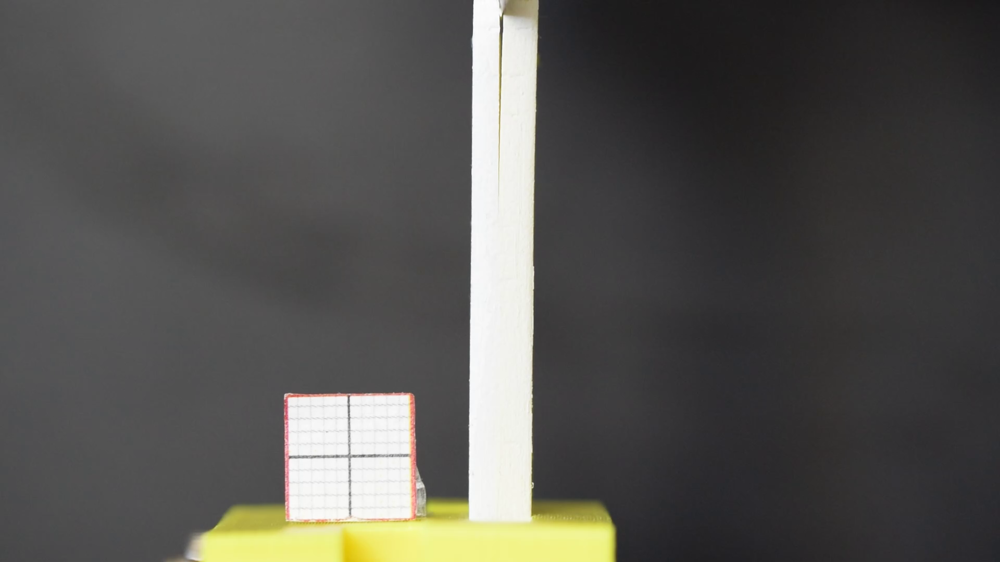
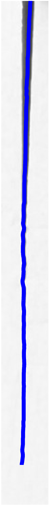
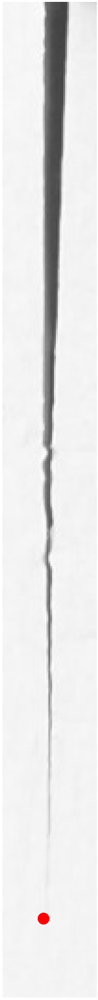
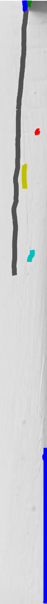
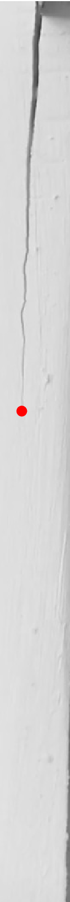

# Ridge Analysis -- Detection of Crack Propagation

This script tracks the crack tip propagation at the interface between two bonded layers in the wedge test.

## Requirement
* ffmpeg
* fiji (imageJ v.2.0), with Ridge Dection Plugin
* Matlab (tested on R2014a)

## Features
* Implements the ridge detection algorithm to unbiasedly dectect contours
* Find the crack tip position from the dective contours and plot against time

## Usage and Examples
### Step 0: Prepare a video
<https://www.youtube.com/watch?v=0GRP7BRfZc8>
### Step 1: Extract images from the video using FFmpeg

### Step 2: Run `crop_gray.m` to crop the area of interst and convert to gray scale for all images.

The script will pause after showing the first image to let you find the size and position of the crop rectangle, specifiied as a four-element vector as shown below.

`cropfig = imcrop(original, [xin, ymin, width, height])`

Press `return` to continue cropping the rest of images.

### Step 3: Run`fijimacro_img_contour.txt` macro in Fiji to detect ridge/lines.

* Open a single image file in fiji first, adjust the parameters in the Ridge Dection plugin until finding a best set of fitting parameter values.
* Specify those values in `fijimacro_img_contour.txt`.

`run("Ridge Detection", "line=3.5 high=230 low=87 darkline...`
`extend display add sigma=1.51 lower=0.85 upper=5.78")`

* The macro will generate images with detected contours overlayed on top of the cropped images and the contour matrices in text file.

### Step 4: Run `Ridge_analysis.m` to find the crack tip position from the detected contours.
* The script superimposes the contours in different colors on the grayscale image and highlights the crack tip with a red circle.
* The crack position in pixels is plotted as a function of time.
* Adjustable parameters can be specified in the beginning of the script:

`#Input parameters`

`final`: number of input images

`initXmin` and `initXmax`: X in pixels where the crack tip falls within this range in the first image

`lowerBound` and `upperBound`: where the crack tip falls within this range for all the images. You should choose a higher range than that in the first image.

`fitting_para = {'line = 4;','high = 230;','low = 87;',...
    'sigma = 1.65;','lower = 0.68;','upper = 4.76'}`: Specify the values you use to run the Ridge Detection. The values of the fitting parameters will be shown in the crack propagation figure.

### Step 5: Convert images to video

##Files
* crop_gray.m
* fijimacro\_img_contour.txt
* Ridge_analysis.m

##References and Credits
* Ridge Detection:
  * Method:

     Steger, C., 1998. An unbiased detector of curvilinear structures. IEEE Transactions on Pattern Analysis and Machine Intelligence, 20(2), pp.113–125.
  * Implementation:

      <https://zenodo.org/record/35440#.VuSxw5MrKRs>

* Thanks Steve Li for his help and discussion.
