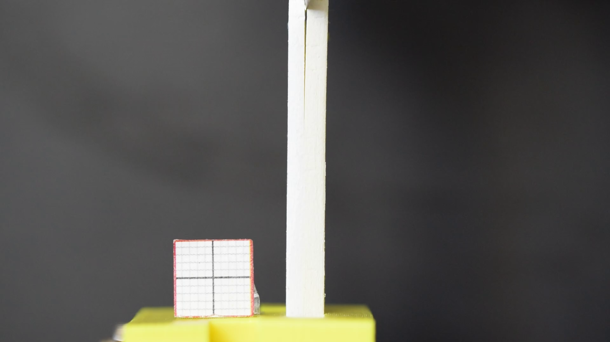
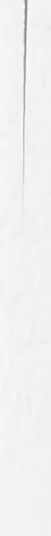
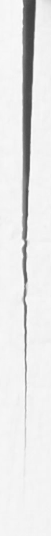
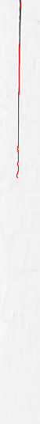
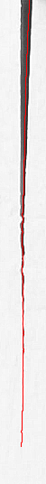
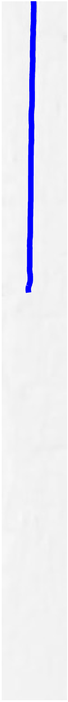
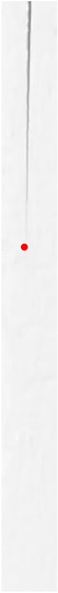
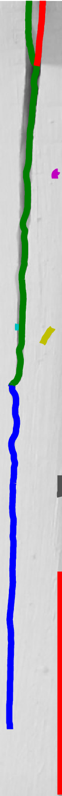
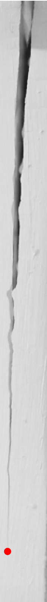
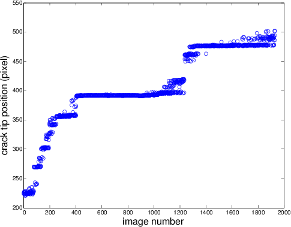

# Ridge Analysis -- Detection of Crack Propagation

This script tracks the crack tip propagation at the interface between two bonded layers in the wedge test.

## Requirement
* [ffmpeg](https://www.ffmpeg.org/)
* [fiji](http://fiji.sc/) (imageJ v.2.0), with [Ridge Dection Plugin](http://imagej.net/Ridge_Detection)
* Matlab (tested on R2014a)

## Features
* Implements the ridge detection algorithm to unbiasedly dectect contours
* Find the crack tip position from the dective contours and plot against time

## Usage and Examples
### Step 0: Prepare a video
[Recorded Video for Wedge Test Analysis](https://www.youtube.com/watch?v=0GRP7BRfZc8)
### Step 1: Extract images from the video using FFmpeg

Run this command on shell

```sh
ffmpeg -i DSC_0068.MOV -r 3 -ss 00:00:00 -t 00:10:40 image-%04d.png

```

We are using the parameters:

* `-i`: the input file name DSC_0068.MOV

* `-r`: extract 3 images every second

* `-ss`: start extracting image from 00:00:00

* `-t`: end extracting image at 00:10:40

* `image-%04d.png`: the format of output images, e.g image-0001.png



### Step 2: Run `crop_gray.m` in Matlab to crop the area of interst and convert to gray scale for all images.

```Matlab
filename = sprintf('./original-image/image-0001.png');
original = imread(filename);
figure
img1 = imshow(original);
pause

nimage = length(dir('./original-image/*.png'));
for i = 1 : nimage;
filename = sprintf('./original-image/image-%04d.png', i);
        original = imread(filename);
        cropfig = imcrop(original, [905, 50, 115, 930]);
        gray = rgb2gray(cropfig);
        imshow(gray);
        %imwrite(gray, sprintf('./crop-image2/%s-%04d-crop.png', 'image', i));
        saveas(gcf, sprintf('./crop-image2/%s-%04d-crop.eps', 'image', i),'epsc');
end

```

The script will pause after showing the first image to let you find the size and position of the crop rectangle, specifiied as a four-element vector as shown below.

`cropfig = imcrop(original, [xin, ymin, width, height])`

Once your are done specifying the crop rectangle and saving the file, move the curser in the command window and press `return` to continue cropping the rest of images.

<table>
  <thead>
  <tr>
    <th align="center">image-0001.png</th>
    <th align="center">image-1931.png</th>
  </tr>
  </thead>
  <tbody>
  <tr>
    <td align="center"></img></td>
    <td align="center"></img></td>
  </tr>
  </tbody>
</table>


### Step 3: Run`fijimacro_img_contour.txt` macro in Fiji to detect ridge/lines.

* Open a single image file in fiji, adjust the parameters in the Ridge Dection plugin until finding a best set of fitting parameter values.

* Specify those values in `fijimacro_img_contour.txt`.

  For example, we are using the parameters:
  
  ```
  run("Ridge Detection", "line=3.5 high=230 low=87 darkline...
  extend display add sigma=1.51 lower=0.85 upper=5.78")
  
  ```

* Run `fijimacro_img_contour.txt` in Fiji by clicking `Plugins`-> `Macros` -> `Run` -> `fijimacro_img_contour.txt`. The macro will run the ridge detection for each image and output two types of files: images with detected contours overlayed on top of the cropped images and the contour matrices in the text file.

<table>
  <thead>
  <tr>
    <th align="center">image-0001.png</th>
    <th align="center">image-1931.png</th>
  </tr>
  </thead>
  <tbody>
  <tr>
    <td align="center"></img></td>
    <td align="center"></img></td>
  </tr>
  </tbody>
</table>


### Step 4: Run `Ridge_analysis.m` in Matlab to find the crack tip position from the detected contours.
* The script superimposes the contours obtained from the ridge detection in different colors on the grayscale image.  From the pool of contour lines, the script is able to find the crack tip position and highlight it with a red circle.

* The figures below show the overlaid contour plots and the highlighted plots from two recorded videos. As can be seen, the second set of images are more noisy than the images in the first set. The noise can result from several factors: lighting, sample preparations, and goodness of fit in Fiji. Nevertheless, the script is able to find the position of the crack tip correctly by applying multiple filters.

 <table>
  <thead>
  <tr>
    <th align="center">Overlay Contour</th>
    <th align="center">Highlight Crack tip</th>
  </tr>
  </thead>
  <tbody>
  <tr>
    <td align="center"></img></td>
    <td align="center"></img></td>
  </tr>
  </tbody>
</table>

 <table>
  <thead>
  <tr>
    <th align="center">Overlay Contour</th>
    <th align="center">Highlight Crack tip</th>
  </tr>
  </thead>
  <tbody>
  <tr>
    <td align="center"></img></td>
    <td align="center"></img></td>
  </tr>
  </tbody>
</table>

* Once the crackp tip position in each image is detected, the crack tip position in pixels is plotted against the image number, as shown below.

 

* Parameters can be specified in the beginning of the script:

 ```Matlab
 % Input parameters

 % number of input images
final = 1931;

 % The lower(initXmin) and uppor(initXmax) bound in pixels along the  x-axis 
 % where the crack tip falls within this range in the first image
initXmin = 20;
initXmax = 40;

 % The lower(lowerBound) and uppor(upperBound) bound in pixels along the x-axis
 % where the crack tip falls within this range for all images. This range 
 % should be set larger than that for the first image. 
lowerBound = 1;
upperBound = 75;

 ```


### Step 5: Convert images to video using FFmpeg

* Run this command on shell

  ```sh
  ffmpeg -r 3 -i image-%04d-overlay.png -codec:v libx264 crackgrowth.mp4
   
  ```

 We are converting the images to a video by using the images with the crack tip highlighted with a red circle. We are using the following parameters:

 * `-r`: create video using 3 images every second

 * `-i`: the input file name, e.g. image-0001-overlay.png

 * `-codec:v`: Set the video codec. We are using the encoder X264

 * `crackgrowth.mp4`: the name of the output video

* Click below for an example video:

  [Crack tip Detection Video](https://youtu.be/g02SjmeXXVY)

##Files
* crop_gray.m
* fijimacro\_img_contour.txt
* Ridge_analysis.m

##References and Credits
* Ridge Detection:
  * Method:

     Steger, C., 1998. An unbiased detector of curvilinear structures. IEEE Transactions on Pattern Analysis and Machine Intelligence, 20(2), pp.113–125.
  * Implementation:

      <https://zenodo.org/record/35440#.VuSxw5MrKRs>

* Thanks Steve Li for his help and discussion.
